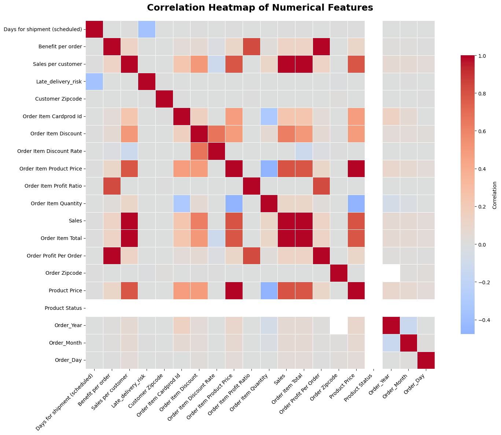
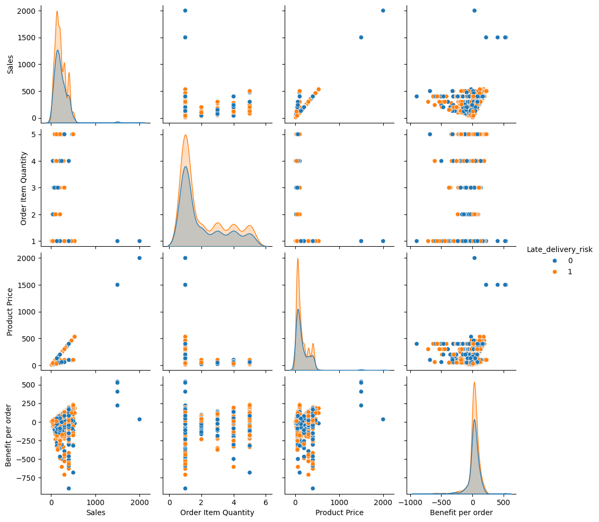
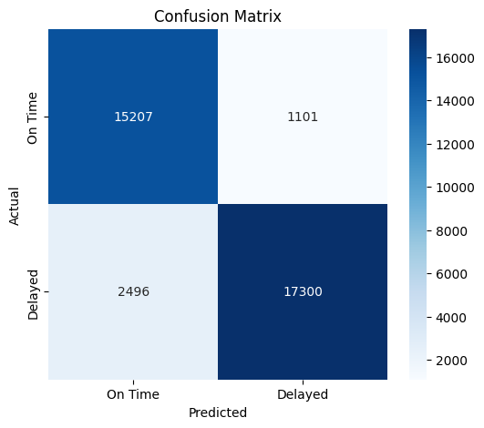
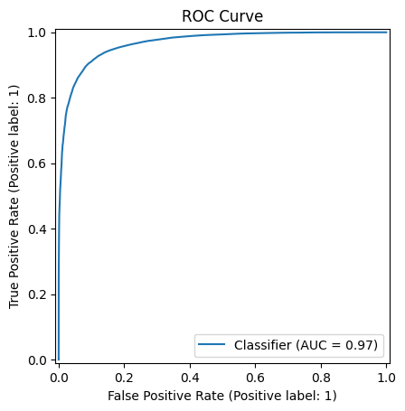
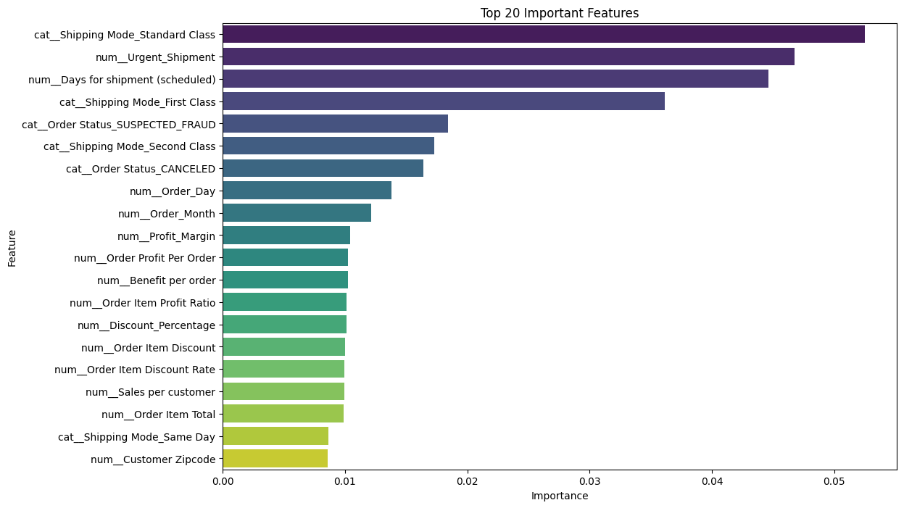

# AI-Powered Supply Chain Risk Intelligence System

> **Predict late-delivery risk before dispatch and turn shipment data into actionable supply-chain intelligence.**

An end-to-end Machine Learning project built on the **DataCo Supply Chain Dataset** to identify orders that are at risk of late delivery. The project covers the complete workflow from data cleaning and exploratory analysis to feature engineering, model comparison, evaluation, feature-importance analysis, cross-validation, and model export.

---

## Project at a Glance

| | |
|---|---|
| **Problem** | Late-delivery risk prediction |
| **Task** | Binary classification |
| **Target** | `Late_delivery_risk` |
| **Dataset** | DataCo Supply Chain Dataset |
| **Records used** | **180,519** |
| **Best model** | **Extra Trees Classifier** |
| **Accuracy** | **90.04%** |
| **Precision** | **94.02%** |
| **Recall** | **87.39%** |
| **F1 Score** | **90.58%** |
| **ROC-AUC** | **96.75%** |
| **Environment** | Google Colab |

### Why this matters

Late deliveries affect customer satisfaction, service-level performance, operational planning, and supply-chain efficiency. A risk-prediction system can help logistics teams **prioritize potentially problematic orders before they become delivery failures**.

---

## Problem Statement

The objective is to predict whether an order is likely to be delivered late.

The problem is formulated as a **binary classification task**:

- `0` → On-time / not identified as late
- `1` → Late-delivery risk

**Target variable:** `Late_delivery_risk`

The dataset contains more than **180K order records**, providing a substantial base for analyzing relationships between order characteristics, shipping configuration, customer segments, product information, geography, and delivery risk.

---

## What This Project Does

The pipeline performs:

- Exploratory Data Analysis (EDA)
- Data cleaning and duplicate removal
- Leakage-aware feature selection
- Date-based feature extraction
- Feature engineering
- Automated numerical/categorical preprocessing
- Multiple model comparison
- Extra Trees model training
- Classification evaluation
- ROC and Precision-Recall analysis
- Feature-importance analysis
- 5-fold cross-validation
- Model and feature-importance export

---

# End-to-End Workflow

```text
                    DataCo Supply Chain Dataset
                                │
                                ▼
                         Data Cleaning
                                │
                                ▼
                    Exploratory Data Analysis
                                │
                                ▼
                       Feature Engineering
                                │
                                ▼
                       Train / Test Split
                           (80 / 20)
                                │
                                ▼
                         Preprocessing
                  ┌─────────────┴─────────────┐
                  │                           │
             Numerical                  Categorical
             Imputation                  Imputation
                  │                           │
            Standard Scaling              One-Hot Encoding
                  └─────────────┬─────────────┘
                                │
                                ▼
                        Model Training
                                │
                                ▼
                        Model Comparison
                                │
                                ▼
                    Select Extra Trees Model
                                │
                                ▼
                       Model Evaluation
                                │
                 ┌──────────────┼──────────────┐
                 ▼              ▼              ▼
            Confusion       ROC-AUC       Precision-Recall
             Matrix
                                │
                                ▼
                       Feature Importance
                                │
                                ▼
                         5-Fold CV Check
                                │
                                ▼
                    Export Trained Model
```

---

# Dataset & Data Preparation

The project loads the **DataCo Supply Chain Dataset** from CSV format and performs an initial inspection using:

- Dataset shape
- Data types
- Descriptive statistics
- Missing-value analysis
- Duplicate detection
- Unique-value analysis

### Duplicate handling

Duplicate rows are identified and removed before modeling.

### Columns removed

The following columns were dropped because they were not useful for the modeling objective or contained high-cardinality, identifying, geographic-coordinate, or descriptive information:

```text
Customer Email
Customer Fname
Customer Lname
Customer Password
Customer Street
Product Description
Product Image
Order Customer Id
Order Id
Order Item Id
Customer Id
Product Card Id
Category Id
Department Id
Product Category Id
Latitude
Longitude
```

### Leakage control

Several fields that can reveal information about the actual delivery outcome were explicitly removed:

```text
Days for shipping (real)
Delivery Status
shipping date (DateOrders)
```

This is important because a delivery-risk model should not depend on information that becomes available only after the shipment outcome is known.

---

# Date Feature Engineering

The original order timestamp:

```text
order date (DateOrders)
```

is converted into useful temporal features:

- `Order_Year`
- `Order_Month`
- `Order_Day`
- `Order_DayOfWeek`

The original timestamp is then removed.

This allows the model to capture potential temporal patterns without directly using the raw timestamp.

---

# Feature Engineering

Several domain-inspired features were created to give the model additional supply-chain and commercial signals.

| Feature | Description |
|---|---|
| `High_Value_Order` | Flags orders above the median sales value |
| `Discount_Percentage` | Discount relative to the item's actual price |
| `Sales_Per_Item` | Total sales normalized by quantity ordered |
| `Profit_Margin` | Benefit per order expressed as a percentage of sales |
| `Urgent_Shipment` | Flags shipments with a scheduled delivery window of 2 days or less |
| `Category_Avg_Sales` | Average sales value for the corresponding product category |
| `Category_Frequency` | Frequency encoding of product categories |
| `Market_Frequency` | Frequency encoding of markets |
| `Order_Size` | Quantity × product price; proxy for overall order size |
| `Price_Difference` | Difference between listed product price and charged price |

These features attempt to convert raw transactional fields into signals that are easier for a machine-learning model to use.

---

# Exploratory Data Analysis

The project investigates delivery risk from multiple perspectives.

### Delivery-risk distribution

The target distribution contains:

- **98,977** records with `Late_delivery_risk = 1`
- **81,542** records with `Late_delivery_risk = 0`

This corresponds to approximately:

- **54.83%** late-risk class
- **45.17%** non-late-risk class

The target is therefore not perfectly balanced, making metrics such as **precision, recall, F1, ROC-AUC, and Precision-Recall analysis** useful alongside accuracy.

### EDA areas covered

- Numerical feature distributions
- Outlier inspection using boxplots
- Correlation heatmap
- Shipping Mode vs. delivery risk
- Market vs. delivery risk
- Customer Segment vs. delivery risk
- Product Category vs. delivery risk
- Top countries by order volume
- Delivery-risk rate by region
- Sales distribution
- Sales vs. delivery risk
- Scheduled shipping time vs. delivery risk
- Pairplot of selected numerical variables

For computational efficiency, the pairplot uses a **random sample of 2,000 records** rather than the full dataset.

---

## EDA Visualizations

### Correlation Heatmap

<p align="center">
  
</p>

### Pair Plot

<p align="center">
  
</p>

---

# Machine Learning Approach

## Train / Test Split

The dataset is split into:

- **80% training data**
- **20% test data**

The split is **stratified on the target variable** so that the class distribution remains approximately consistent across the training and test sets.

---

## Preprocessing Pipeline

A `ColumnTransformer` is used to apply different preprocessing strategies to numerical and categorical variables.

### Numerical features

```text
Median Imputation
        ↓
Standard Scaling
```

### Categorical features

```text
Most-Frequent Imputation
        ↓
One-Hot Encoding
```

Categorical encoding uses:

```python
OneHotEncoder(handle_unknown="ignore")
```

The complete preprocessing stage is wrapped together with the classifier inside a Scikit-learn `Pipeline`.


---

# Models Compared

Five classification algorithms were evaluated using the same preprocessing workflow:

1. **Logistic Regression**
2. **Decision Tree**
3. **Random Forest**
4. **Extra Trees**
5. **Gradient Boosting**

The model-comparison loop evaluates:

- Accuracy
- Precision
- Recall
- F1 Score

---

# Model Performance

| Model | Accuracy | Precision | Recall | F1 Score |
|---|---:|---:|---:|---:|
| 🥇 **Extra Trees** | **90.04%** | **94.02%** | **87.39%** | **90.58%** |
| Decision Tree | 83.23% | 85.28% | 83.91% | 84.59% |
| Random Forest | 79.86% | 89.72% | 71.46% | 79.56% |
| Logistic Regression | 73.43% | 80.84% | 67.55% | 73.60% |
| Gradient Boosting | 71.57% | 87.18% | 56.46% | 68.53% |

> **Extra Trees achieved the strongest overall performance in the recorded model comparison, with an F1 Score of 90.58% and Accuracy of 90.04%.**

---

# Final Model: Extra Trees Classifier

The final selected model is:

```python
ExtraTreesClassifier(random_state=42)
```

It was selected based on its performance across the evaluated metrics.

### Final test-set metrics

| Metric | Score |
|---|---:|
| Accuracy | **90.04%** |
| Precision | **94.02%** |
| Recall | **87.39%** |
| F1 Score | **90.58%** |
| ROC-AUC | **96.75%** |


---

# Model Evaluation

The final model is evaluated using several complementary diagnostics.

## Confusion Matrix

<p align="center">
  
</p>

The confusion matrix provides a direct view of correct and incorrect predictions for the two classes.

---

## ROC Curve

<p align="center">
  
</p>

The ROC curve examines the trade-off between:

- True Positive Rate
- False Positive Rate

The final model achieved a **ROC-AUC of 0.9675**.


---

## Feature Importance

Feature importance is extracted directly from the trained Extra Trees classifier.

### Top features recorded by the model

| Rank | Feature | Importance |
|---:|---|---:|
| 1 | `Shipping Mode_Standard Class` | 0.05250 |
| 2 | `Urgent_Shipment` | 0.04677 |
| 3 | `Days for shipment (scheduled)` | 0.04464 |
| 4 | `Shipping Mode_First Class` | 0.03614 |
| 5 | `Order Status_SUSPECTED_FRAUD` | 0.01840 |
| 6 | `Shipping Mode_Second Class` | 0.01729 |
| 7 | `Order Status_CANCELED` | 0.01640 |
| 8 | `Order_Day` | 0.01383 |
| 9 | `Order_Month` | 0.01212 |
| 10 | `Profit_Margin` | 0.01040 |

The results suggest that **shipping configuration and scheduled delivery constraints are among the strongest predictive signals** in the trained model.

> Feature importance indicates predictive contribution within this trained model; it should **not** be interpreted as causal evidence that a feature directly causes late delivery.

<p align="center">
  
</p>

---


# Saved Model & Results

The project exports the trained model using `joblib`:

```text
supply_chain_risk_model.pkl
```


---

# Tech Stack

| Technology | Purpose |
|---|---|
| **Python** | Core programming language |
| **Pandas** | Data manipulation |
| **NumPy** | Numerical computing |
| **Scikit-learn** | Preprocessing, modeling, evaluation |
| **Matplotlib** | Visualization |
| **Seaborn** | Statistical visualization |
| **Joblib** | Model serialization |
| **Google Colab** | Development environment |

---


# Project Highlights

### Dataset
**180K+ supply-chain order records**

### Target
**Late delivery risk**

### Best Model
**Extra Trees Classifier**

### Best F1
**90.58%**

### Precision
**94.02%**

### Recall
**87.39%**

### ROC-AUC
**96.75%**

### Validation
**80/20 stratified split + optional 5-fold cross-validation**

### Output
**Reusable serialized ML pipeline + feature-importance CSV**

---

# Project Focus

This project combines:

**Machine Learning + Supply Chain Analytics + Feature Engineering + Operational Risk Intelligence**

The main goal is not simply to maximize a classification score, but to demonstrate how a structured ML pipeline can transform historical supply-chain data into **early-warning signals for logistics decision-making**.

---


